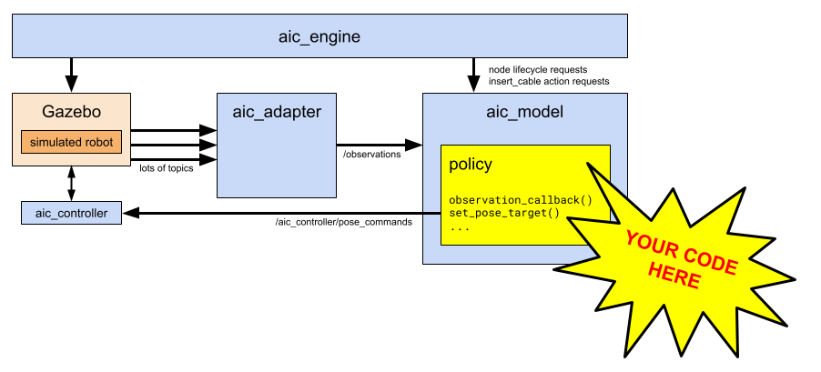

# Writing a Policy

Like many aspects of computing, AI terms such as _model_ and _policy_ are used
in many contexts and can have differing meanings. The following diagram shows
how these terms are used in the software blocks of the AI for Industry
Challenge:



A _policy_ is the software which consumes sensor data and produces output
commands to the robot. Creating a _policy_ is at the heart of the AI for
Industry Challenge, since it is the critical block that "closes the loop"
between sensors and actuators.

More specifically, the _policy_ receives the following data:
 * images from three cameras mounted on the robot wrist
 * joint angles of the robot arm and gripper
 * 3d force and 3d torque measurements at the robot wrist
 * a transform between the gripper-fingers tool center point (TCP) and the
   center of the robot base

For convenience, the Challenge environment combines time-synchronized values of
the sensor suite into a single composite message, `Observation.msg`, which is
delivered to the `aic_model` block at 20 Hz. In turn, the `aic_model` block passes
these messages to a user-defined `policy`, which is dynamically loaded at runtime.

Several API styles are possible.

## ROS Policy API

To define a policy using ROS data structures, such as `geometry_msgs.msg.Pose`,
`sensor_msgs.msg.Image`, and so on:
 * define a Python class which derives from `PolicyRos`
 * implement callbacks as needed to respond to the challenge environment:
   * `start_task_callback()`: called when `aic_engine` requests a new task.
   * `stop_task_callback()`: called when `aic_engine` requests to stop the current task.
   * `observation_callback()`: called when a new observation message arrives, at 20 Hz.
 * supply this Python class name as a parameter to `aic_model`.

The _policy_ can invoke API functions which issue motion commands to the robot.
As an implementation detail, those API functions use the `aic_model` ROS node
to publish data to the `aic_controller`, which is implemented in the
[`ros2_control`](https://control.ros.org/rolling/index.html) framework.

## Example

To make this concrete, a [minimal example](https://github.com/intrinsic-dev/aic/blob/main/aic_example_policies/aic_example_policies/ros/WaveArm.py)
, `WaveArm`, shows how to implement the necessary callbacks and issue motion
commands to the arm.

The class name is provided when starting the `aic_model` ROS node.
Conveniently, this can be done on the command line for interactive development:

```
ros2 run aic_model aic_model --ros-args -p policy:=aic_example_policies.ros.WaveArm
```
