# AIC Task Board Technical Specification

The **AI for Industry Challenge (AIC)** task board is a modular, fungible platform designed to emulate real-world cable management challenges found in high-mix electronics manufacturing, specifically within server and data center infrastructure. This board serves as the primary environment for evaluating dexterous manipulation, perception, and motion planning throughout the challenge phases.

## 1. Board Overview

The task board provides a standardized physical interface for the manipulation of **SFP (Small Form-factor Pluggable)** and **SC (Subscriber Connector) optical fiber** cables. It is divided into four distinct zones to separate the assembly targets from the initial component pick locations.

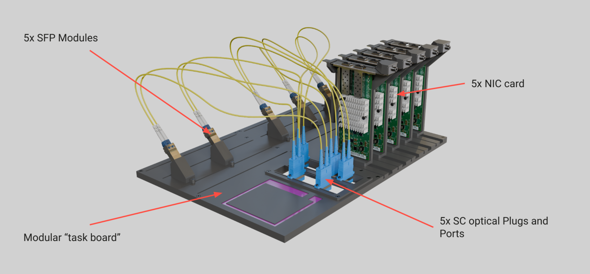

## 2. Zone Descriptions

### Zone 1: Network Interface Cards (NIC)

This zone represents the networking switch or server compute tray where data links are established.

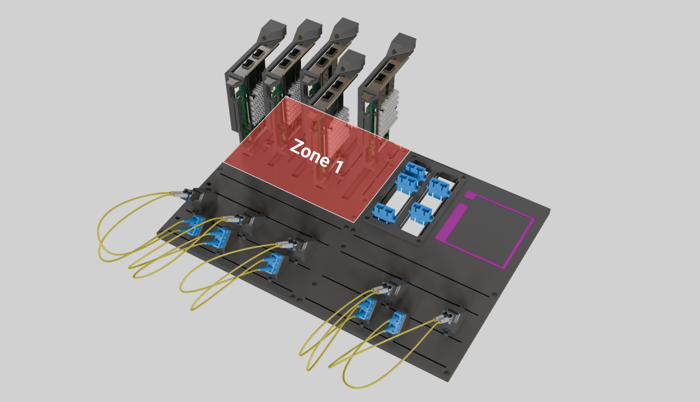

* **Rails:** Contains five mounting rails named `NIC_RAIL_0` through `NIC_RAIL_4`.
* **Components:** Supports up to five dual-port network cards, named `NIC_CARD_0` through `NIC_CARD_4`.
* **Ports:** Each card features two SFP ports named `SFP_PORT_0` and `SFP_PORT_1`.
* **Mobility:** Cards are designed to slide along their respective rails to allow for randomized positional and orientation offsets during the challenge.
  * *TODO: Specify slide travel limits (e.g., +/- X mm).*

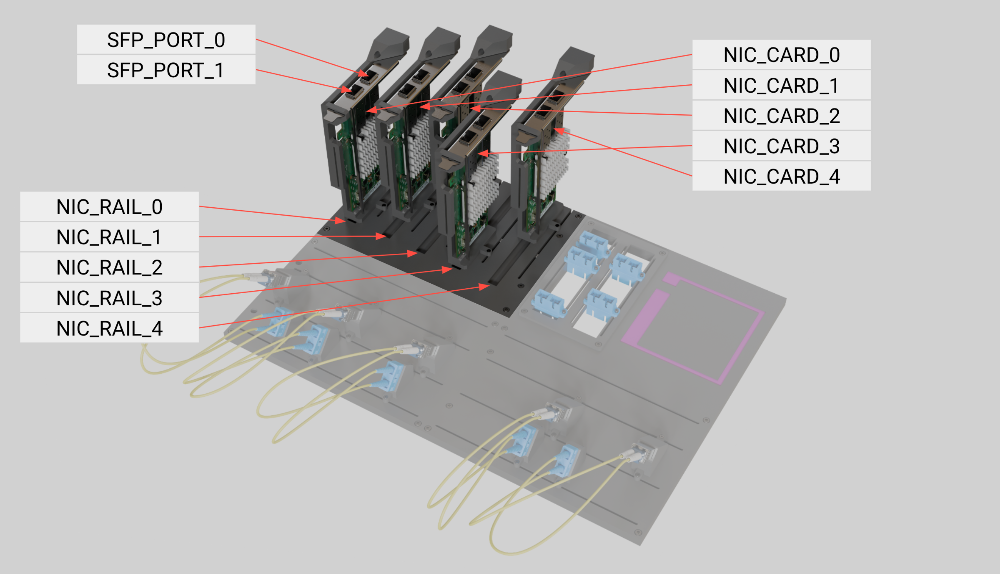

### Zone 2: SC Optical Ports

This zone emulates the optical patch panel or backplane of a server rack.

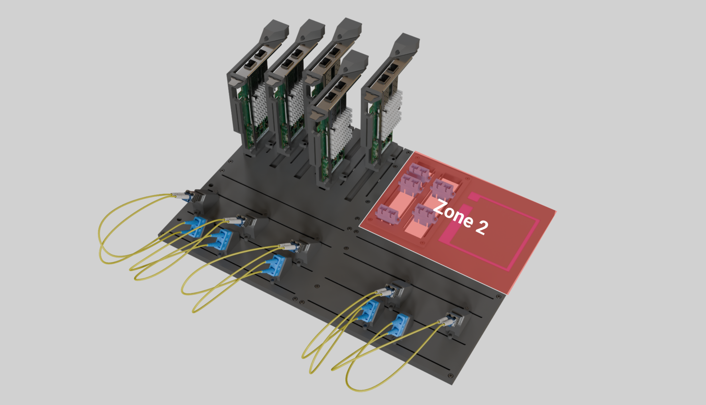

* **Rails:** Features two parallel rails named `SC_RAIL_0` and `SC_RAIL_1`.
* **Ports:** Supports up to five SC ports in total, named `SC_PORT_0` through `SC_PORT_4`.
* **Mobility:** Ports are designed to be positioned on either rails, and slide along them to allow for randomized positional offsets during the challenge.
  * *TODO: Specify slide travel limits (e.g., +/- X mm).*

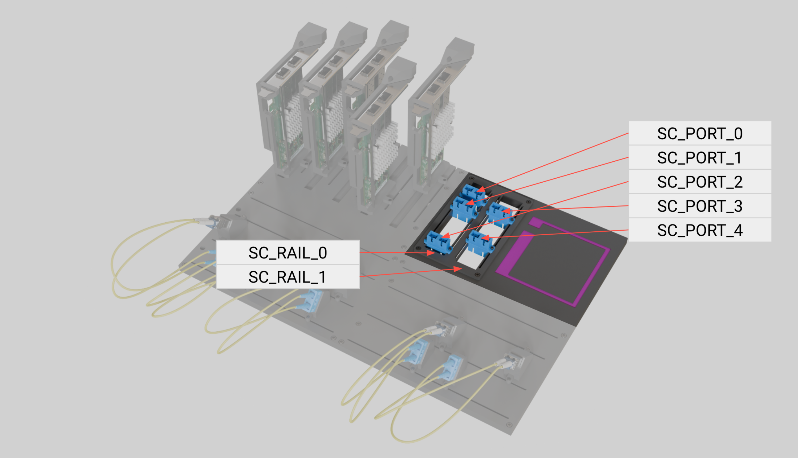

### Zone 3: First Pick Location

Zone 3 serves as one of the organized supply area for components before they are routed and inserted.

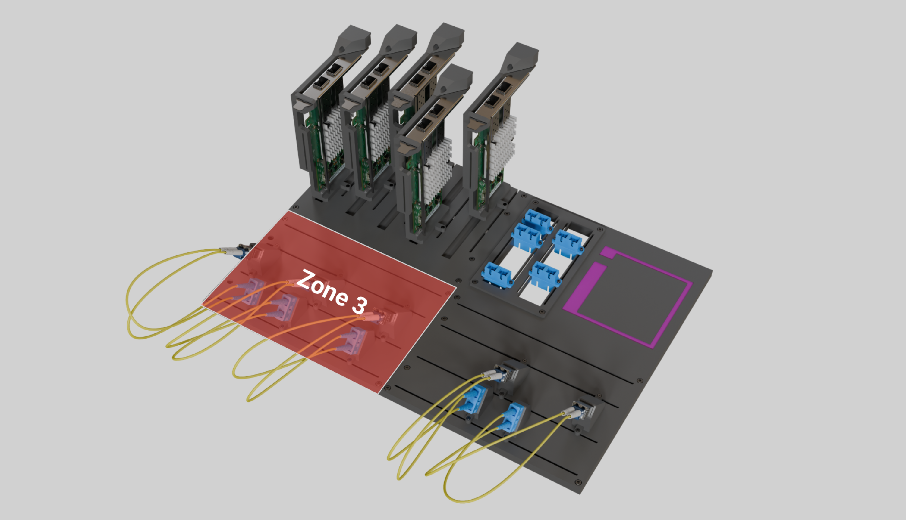

* **Rails:** Three mounting rails named `LC_MOUNT_RAIL_0` `SFP_MOUNT_RAIL_0` and `SC_MOUNT_RAIL_0`.
* **Mounts:** Holds "mounts" (or fixtures) for LC and SC plugs, or SFP modules.
* **Naming Convention:**
  * **LC Ports:** `LC_MOUNT_0` through `LC_mount_i`, where i is the total count for the task.
  * **LC Plugs:** `LC_PLUG_0` through `LC_PLUG_i`, where i is the total count for the task.
  * **SC Ports:** `SC_MOUNT_0` through `SC_mount_j`, where j is the total count for the task.
  * **SC Plugs:** `SC_PLUG_0` through `SC_PLUG_j`, where j is the total count for the task.
  * **SFP Ports:** `SFP_MOUNT_0` through `SFP_MOUNT_k`, where k is the total count for the task.
  * **SFP Modules:** `SFP_MODULE_0` through `SFP_MODULE_k`, where k is the total count for the task.
* **Customization:** Fixtures can be placed on any rail in any order, creating a high-mix environment.
  * *TODO: Specify slide travel limits (e.g., +/- X mm).*
  * *TODO: Specify minimum spacing between mounts to avoid finger collision (e.g., Y mm). *

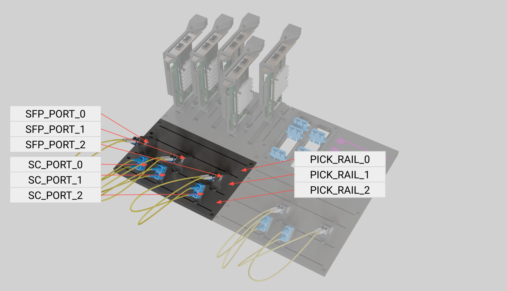
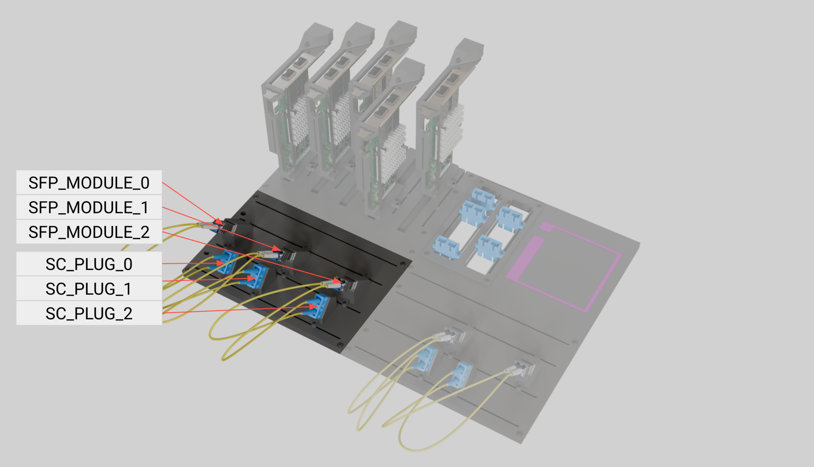

### Zone 4: Second Pick Location

Zone 4 is identical in function and layout to Zone 3.

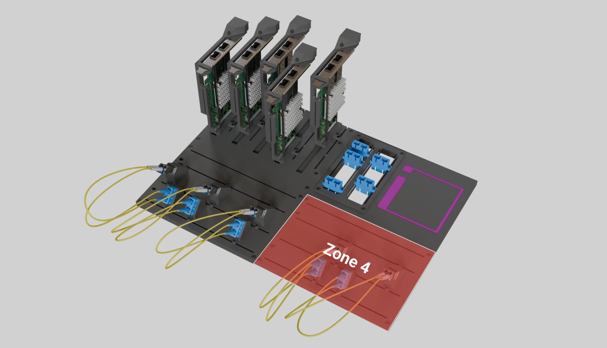

* **Rails:** Three mounting rails named `LC_MOUNT_RAIL_1` `SFP_MOUNT_RAIL_1` and `SC_MOUNT_RAIL_1`.
* **Configuration:** Mirroring Zone 3, this area holds the remaining LC plugs, SC plugs and SFP modules required for full assembly completion.

## 3. Reference Frames

To ensure precision during dexterous manipulation and seamless sim-to-real transfer, the toolkit uses a standardized coordinate system. All poses are defined relative to the board's primary datum.

* **World frame (`world`):** The global origin, located at the base and center of the enclosure.
* **Robot frame (`robot`):** The robot base frame, located at the base of the robot.
* **`Tool_frame`:** The Tool Center Point located between the gripper fingers.
* **Task board frame (`task_board_base`):** The primary reference for the task board, located at the bottom-left corner of the board.
* **Zone frames (`zone_1` to `zone_4`):** Local origins for each zone. Located at the bottom-left corner of each zone.
* **Component frames:**
  * **nic_card_N:** Center of mass (volume) of the NIC card model.
  * **sfp_port_N:** Center of the x/y plane for the SFP port opening on the NIC card. The X-axis is normal to the PCB surface (horizontal), the Z-axis is the extraction vector (pointing up, away from the port).
  * **sc_port_N:** Center of the x/y plane for the SC port opening on the NIC card. The X-axis is parallel to the board x axis, the Z-axis is the extraction vector (pointing up, away from the port).
  * **lc_plug_N:** Center of mass (volume) of the LC plug model.
  * **sc_plug_N:** Center of mass (volume) of the SC plug model.
  * **sfp_module_N:** Center of mass (volume) of the SFP module model.
  * **lc_mount_N:** Center of the x/y plane for the LC mount port opening. The X-axis is parallel to the board x axis, the Z-axis is the extraction vector (pointing up, away from the mount).
  * **sc_mount_N:** Center of the x/y plane for the SC mount port opening. The X-axis is parallel to the board x axis, the Z-axis is the extraction vector (pointing up, away from the mount).
  * **sfp_mount_N:** Center of the x/y plane for the SFP mount port opening. The X-axis is parallel to the board x axis, the Z-axis is the extraction vector (pointing up, away from the mount).

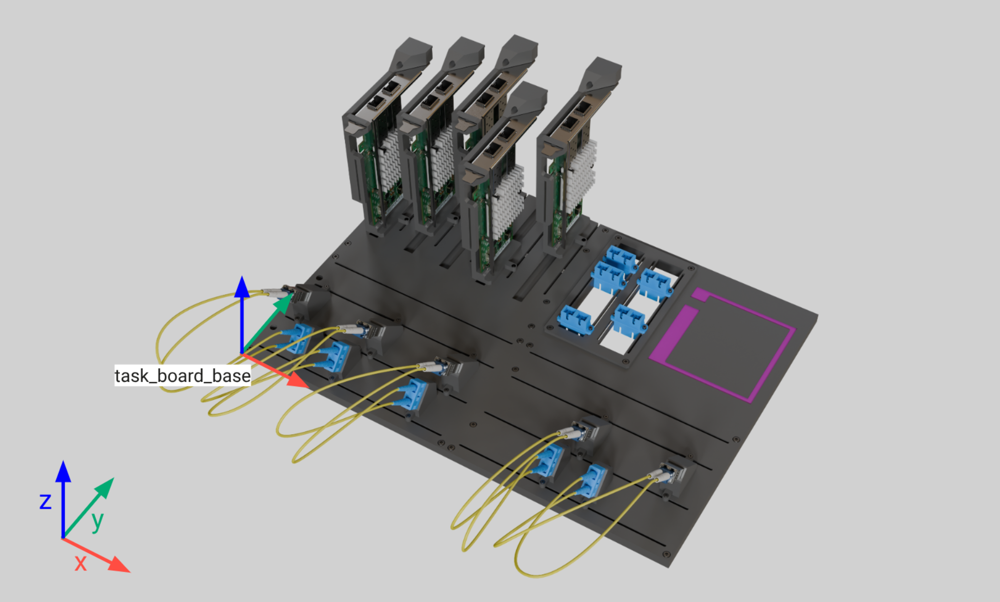
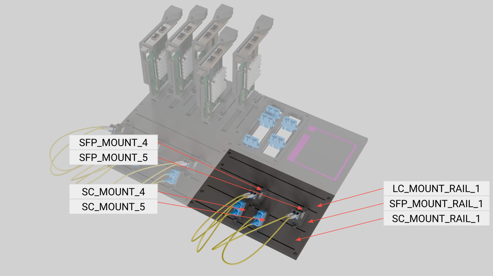
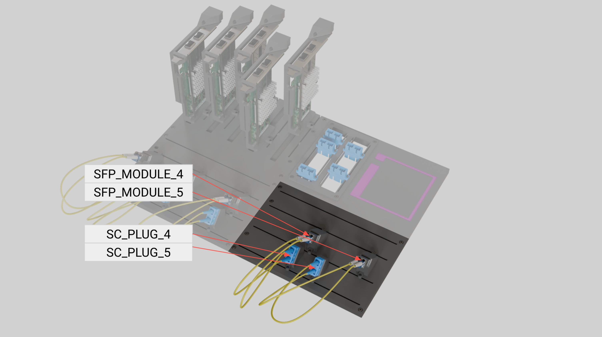

## 4. YAML Configuration Structure

The toolkit uses a YAML-based "Scene Description File" to define the board's state for each trial. This file allows for the randomization of components within the rail limits specified in the task description.

See ... for the full scene scene YAML.

### Example `board_config.yaml`

```yaml
# AIC Task Board Configuration
metadata:
  version: "1.0"
  description: "Qualification Randomized Setup"

zones:
  zone_1:
    - id: "NIC_CARD_0"
      rail: "NIC_CARD_0"
      position: 0.02  # Meters along rail
      ports: ["SFP_PORT_0", "SFP_PORT_1"]
    - id: "NIC_CARD_1"
      rail: "NIC_CARD_1"
      position: 0.035
        
  zone_2:
    - id: "SC_PORT_0"
      rail: "SC_RAIL_0"
      position: 0.05  # Randomized position along rail
    - id: "SC_PORT_1"
      rail: "SC_RAIL_1"
      position: 0.03

  zone_3:
    - id: "SC_PORT_0"
      rail: "PICK_RAIL_0"
      position: 0.02
    - id: "SFP_PORT_0"
      rail: "PICK_RAIL_1"
      position: 0.045

  zone_4:
    - id: "SC_PORT_1"
      rail: "PICK_RAIL_3"
      position: 0.04
    - id: "SFP_PORT_1"
      rail: "PICK_RAIL_5"
      position: 0.045

```
