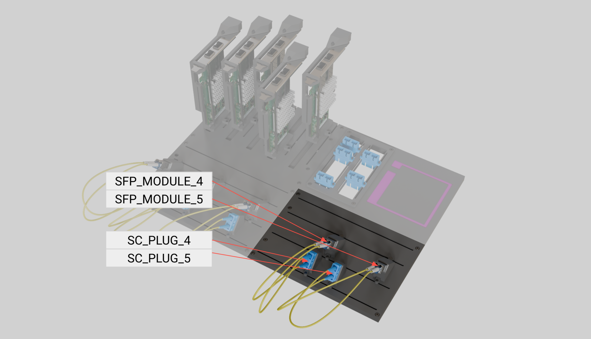

# AIC Task Board Technical Specification

The **AI for Industry Challenge (AIC)** task board is a modular, fungible platform designed to emulate real-world cable management challenges found in high-mix electronics manufacturing, specifically within server and data center infrastructure. This board serves as the primary environment for evaluating dexterous manipulation, perception, and motion planning throughout the challenge phases.

## 1. Board Overview

The task board provides a standardized physical interface for the manipulation of **SFP (Small Form-factor Pluggable)** and **SC (Subscriber Connector) optical fiber** cables. It is divided into four distinct zones to separate the assembly targets from the initial component pick locations.


## 2. Zone Descriptions

### Zone 1: Network Interface Cards (NIC)

This zone represents the networking switch or server compute tray where data links are established.


* **Rails:** Contains five mounting rails named `NIC_RAIL_0` through `NIC_RAIL_4`.
* **Components:** Supports up to five dual-port network cards, named `NIC_CARD_0` through `NIC_CARD_4`.
* **Ports:** Each card features two SFP ports named `SFP_PORT_0` and `SFP_PORT_1`.
* **Mobility:** Cards are designed to slide along their respective rails to allow for randomized positional and orientation offsets during the challenge.
  * *TODO: Specify slide travel limits (e.g., +/- X mm).*


### Zone 2: SC Optical Ports

This zone emulates the optical patch panel or backplane of a server rack.


* **Rails:** Features two parallel rails named `SC_RAIL_0` and `SC_RAIL_1`.
* **Ports:** Supports up to five SC ports in total, named `SC_PORT_0` through `SC_PORT_4`.
* **Mobility:** Ports are designed to be positioned on either rails, and slide along them to allow for randomized positional offsets during the challenge.
  * *TODO: Specify slide travel limits for rail positioning.*


### Zone 3: Primary Pick Location

Zone 3 serves as the organized supply area for components before they are routed and inserted.


* **Rails:** Three mounting rails named `PICK_RAIL_0` through `PICK_RAIL_2`.
* **Fixtures:** Holds "ports" (fixtures) for either SC plugs or SFP modules.
* **Naming Convention:**
  * **SC Ports:** `SC_PORT_0` through `SC_PORT_N` (where N is the total count for the task).
  * **SC Plugs:** `SC_PLUG_0` through `SC_PLUG_N` (where N is the total count for the task).
  * **SFP Ports:** `SFP_PORT_0` through `SFP_PORT_M` (where M is the total count for the task).
  * **SFP Modules:** `SFP_MODULE_0` through `SFP_MODULE_M` (where M is the total count for the task).
* **Customization:** Fixtures can be placed on any rail in any order, creating a high-mix environment.
  * *TODO: Specify minimum spacing between fixtures to prevent gripper collisions.*


### Zone 4: Secondary Pick Location

Zone 4 is identical in function and layout to Zone 3, providing additional capacity for complex, high-density assembly tasks.


* **Rails:** Named `PICK_RAIL_3` through `PICK_RAIL_5`.
* **Configuration:** Mirroring Zone 3, this area holds the remaining SC plugs and SFP modules required for full assembly completion.

## 3. Reference Frames

To ensure precision during dexterous manipulation and seamless sim-to-real transfer, the toolkit uses a standardized coordinate system. All poses are defined relative to the board's primary datum.

* **World Frame (`world`):** The global origin, located at the base of the workcell.
* **Robot Frame (`robot`):** The robot base frame, location at the base of the robot.
* **Board Frame (`task_board_base`):** The primary reference for all zones, located at the bottom-left corner of the modular baseplate.
* **Zone Frames (`zone_1` to `zone_4`):** Local origins for each functional area to simplify relative positioning of rails and fixtures. Located at the bottom-left corner of each zone.
* **`Tool_frame`:** The Tool Center Point located between the fingers.
* **Component Frames:**
  * **`NIC_CARD_N`:** Centered on the leading edge of the network card.
  * **`SFP_PORT_N`:** TODO: Define frame.
  * **`SC_PORT_N`:** TODO: Define frame.
  * **`SC_PLUG_N`:** TODO: Define frame.
  * **`SFP_MODULE_N`:** TODO: Define frame.




## 4. YAML Configuration Structure

The toolkit uses a YAML-based "Scene Description File" to define the board's state for each trial. This file allows for the randomization of components within the rail limits specified in the task description.

### Example `board_config.yaml`

```yaml
# AIC Task Board Configuration
metadata:
  version: "1.0"
  description: "Qualification Randomized Setup"

zones:
  zone_1:
    - id: "NIC_CARD_0"
      rail: "NIC_CARD_0"
      position: 0.02  # Meters along rail
      ports: ["SFP_PORT_0", "SFP_PORT_1"]
    - id: "NIC_CARD_1"
      rail: "NIC_CARD_1"
      position: 0.035
        
  zone_2:
    - id: "SC_PORT_0"
      rail: "SC_RAIL_0"
      position: 0.05  # Randomized position along rail
    - id: "SC_PORT_1"
      rail: "SC_RAIL_1"
      position: 0.03

  zone_3:
    - id: "SC_PORT_0"
      rail: "PICK_RAIL_0"
      position: 0.02
    - id: "SFP_PORT_0"
      rail: "PICK_RAIL_1"
      position: 0.045

  zone_4:
    - id: "SC_PORT_1"
      rail: "PICK_RAIL_3"
      position: 0.04
    - id: "SFP_PORT_1"
      rail: "PICK_RAIL_5"
      position: 0.045

```
